# Osteosarcoma Histopathology Classification & Analysis Pipeline

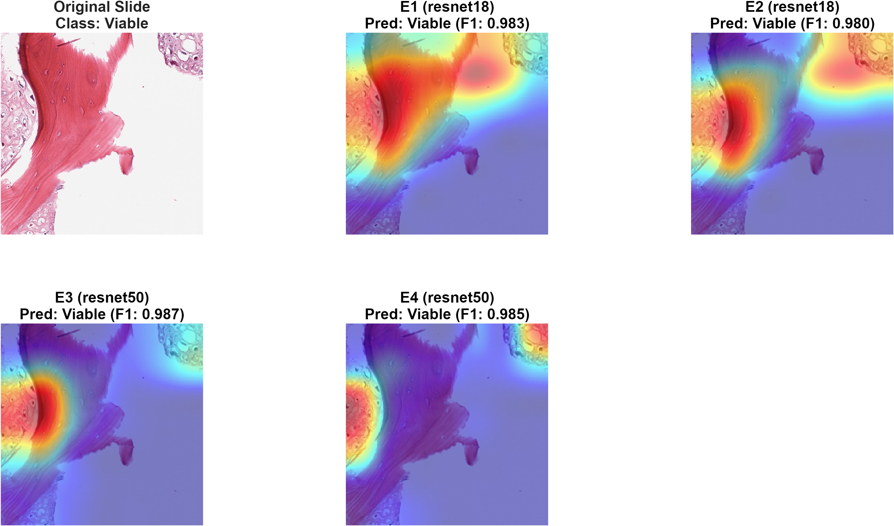 *(Example Grad-CAM activation on a Viable Tumor Slide)*

## Project Overview
This repository contains a complete experimental pipeline for classifying Osteosarcoma (Bone Cancer) histopathology images using Deep Convolutional Neural Networks (ResNet-18 and ResNet-50).

The research focuses on the impact of **Class Balancing through Data Augmentation** and how network depth influences classification capabilities.

---

## Dataset Classes

The dataset is categorized into three primary classes. Below are raw examples directly from the `dataset_original` test set:

| Non-Tumor | Non-Viable-Tumor | Viable |
| :---: | :---: | :---: |
| 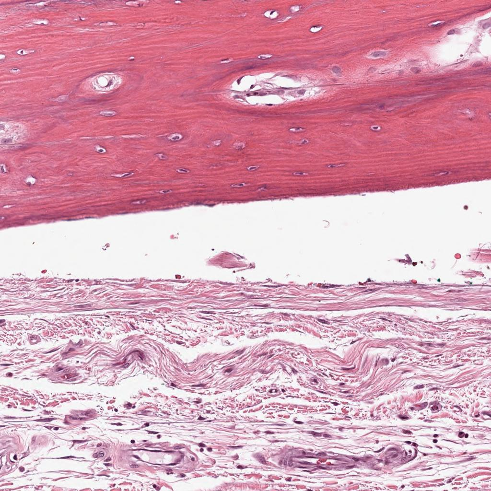 | 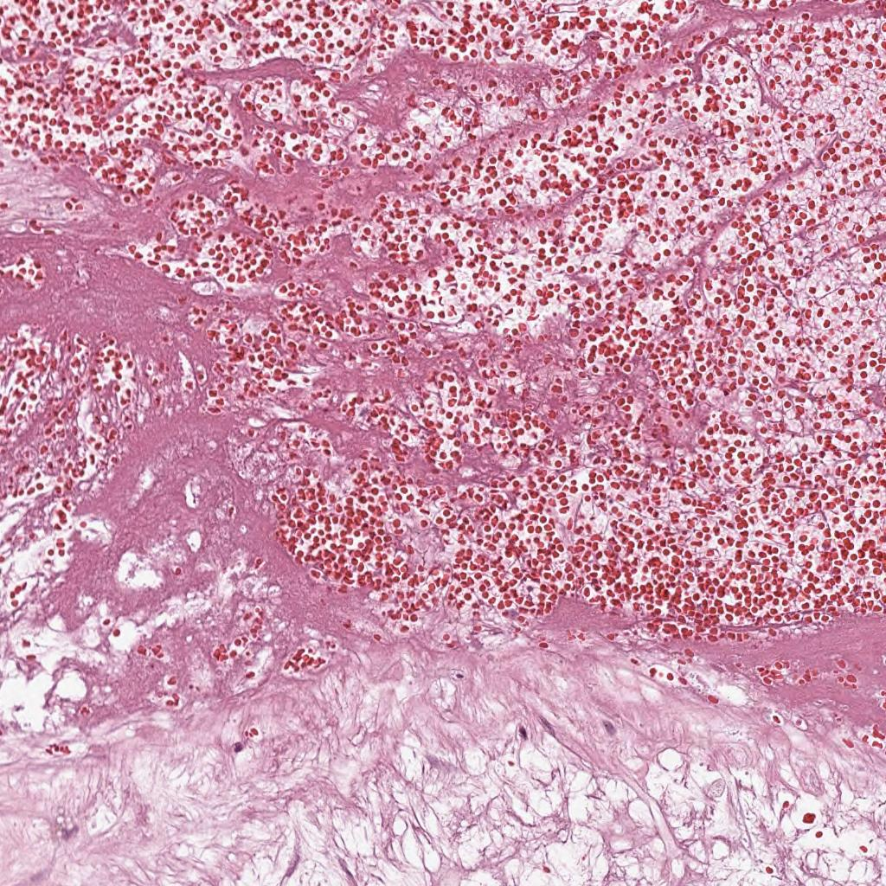 | 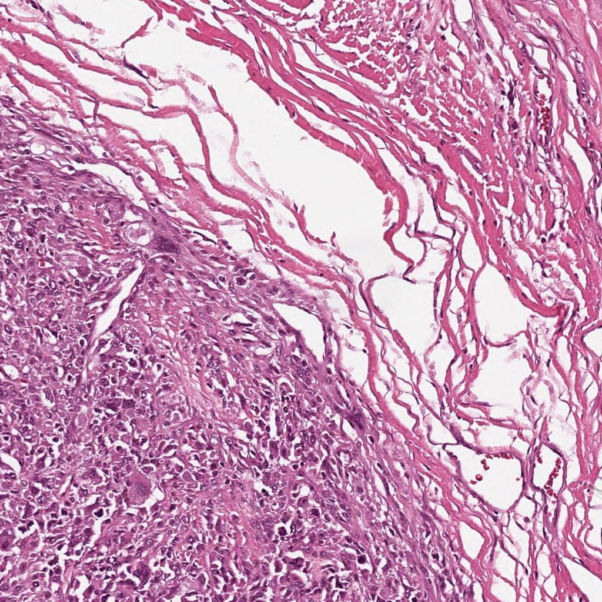 |
| Healthy tissue, completely free from cancerous cells. | Necrotic (dead) tumor tissue, often a sign of successful chemotherapy. | Active, dividing cancer cells indicating aggressive tumor presence. |

---

## Dataset & Class Balancing (S01)
The project utilizes two distinct datasets to evaluate model robustness:
- **`dataset_original`**: The baseline dataset, preserving the natural imbalance of medical imaging where certain diagnostic classes are much rarer than others.
- **`dataset_balanced`**: A synthetically balanced dataset utilizing programmatic Data Augmentation (Rotation, Translation, Zoom, Color Jitter) specifically targeting minority classes to achieve a perfect 1:1:1 distribution (1078 images per class).

---

## Experimental Matrix (S02)
We evaluate the dataset permutations against two state-of-the-art CNN architectures, producing 4 distinct experimental environments (E1-E4). Transfer learning is applied by replacing the terminal fully connected layers.

| Experiment | Architecture | Dataset Condition | Goal |
|---|---|---|---|
| **E1** | ResNet-18 | Original (Imbalanced) | Baseline performance |
| **E2** | ResNet-18 | Balanced (Augmented) | Evaluate augmentation impact on shallow networks |
| **E3** | ResNet-50 | Original (Imbalanced) | Baseline performance for deep networks |
| **E4** | ResNet-50 | Balanced (Augmented) | Evaluate augmentation impact on deep networks |

*Models were trained sequentially across multiple epoch checkpoints (Epoch 4, 8, 12, 16, 20).*

---

## Results & Analytics (S04)

Our exhaustive statistical framework evaluates the model's performance on the unseen `dataset_original/test` split.

### 1. Training Convergence
We tracked the learning curve across epochs to pinpoint exactly when the models converged and when they began to overfit.

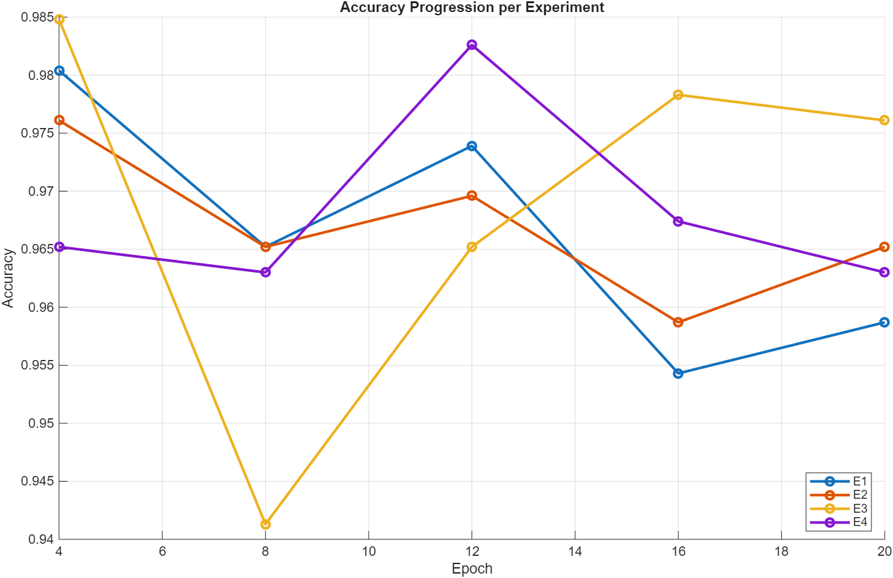
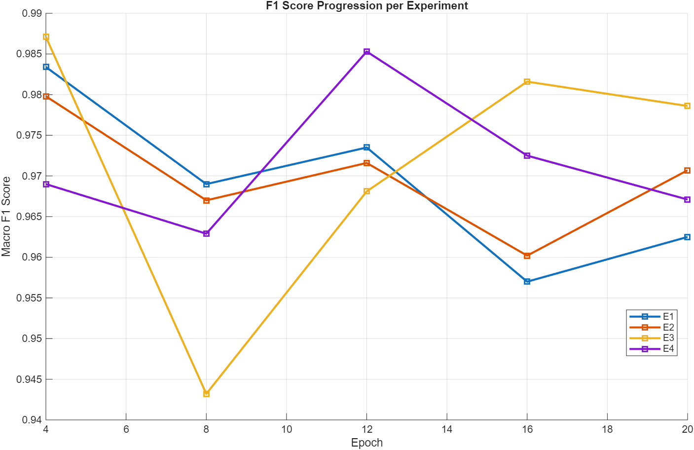
*Peak performance generally stabilized around Epoch 12-16 across all models.*

### 2. Peak Model Performance
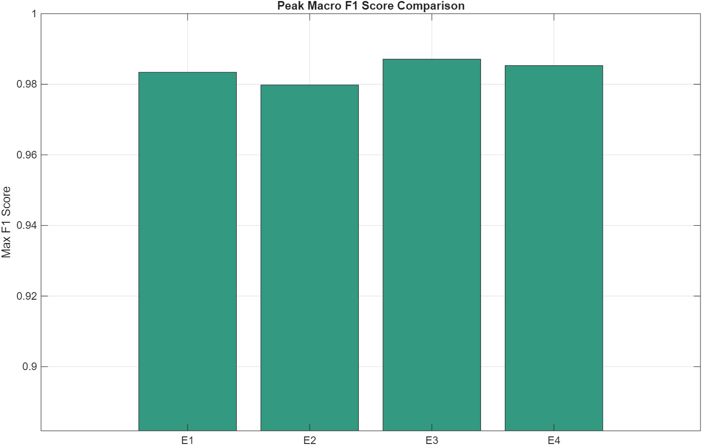

### 3. Comprehensive Classification Metrics (Precision & Recall)
Beyond simple global accuracy, it is critical in medical imaging to measure the exact per-class metrics. We evaluated:
- **Precision**: When the model predicts "Viable", how often is it actually Viable? (Minimizing False Positives)
- **Recall**: Out of all the truly "Viable" tumors, how many did the model successfully find? (Minimizing False Negatives)
- **F1-Score**: The harmonic mean of Precision and Recall, providing a single robust metric for imbalanced classes.

| Precision | Recall | F1 Score |
| :---: | :---: | :---: |
| 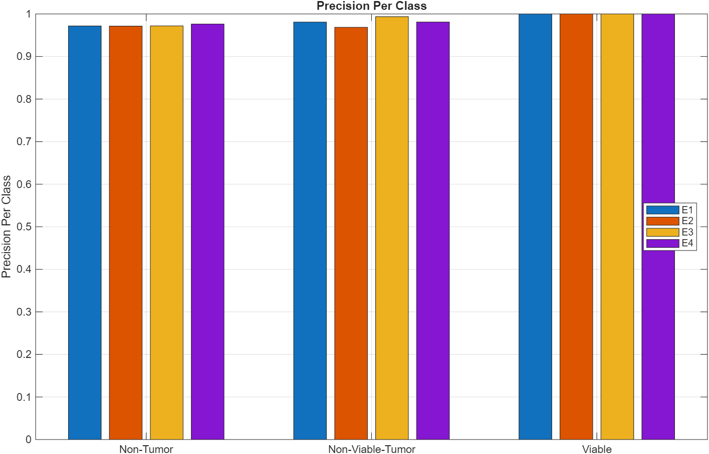 | 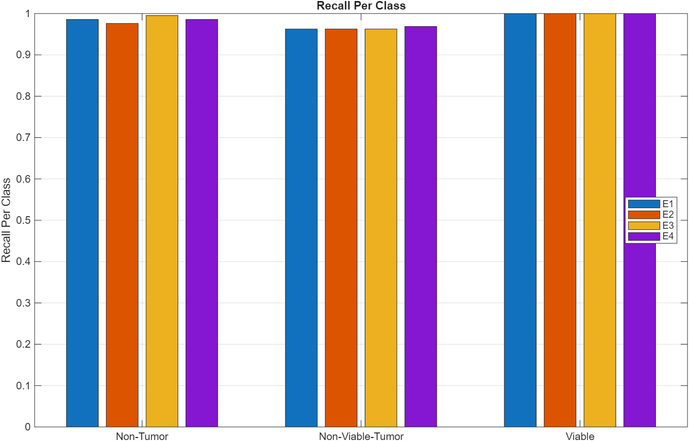 | 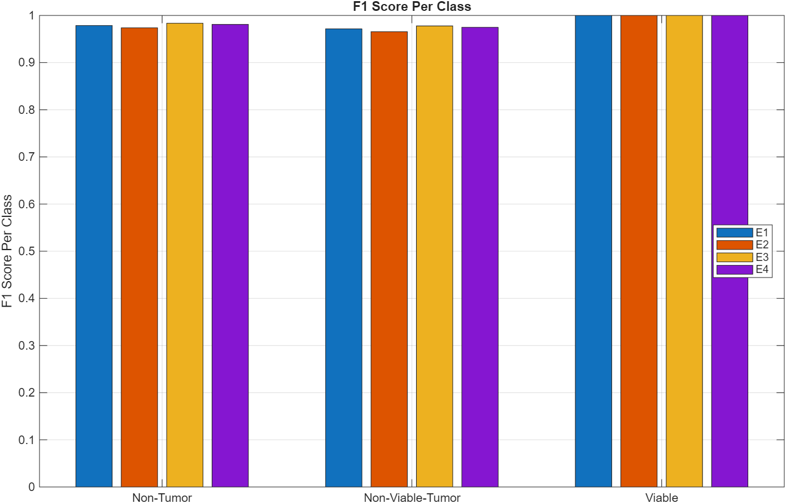 |

### 4. Confusion Matrices
The confusion matrices highlight the models' specific failure points, primarily distinguishing between heavily necrotized tissue (Non-Viable) and active cancerous regions (Viable).

| E1 (ResNet-18 Original) | E2 (ResNet-18 Balanced) |
| :---: | :---: |
|  |  |
| **E3 (ResNet-50 Original)** | **E4 (ResNet-50 Balanced)** |
|  | 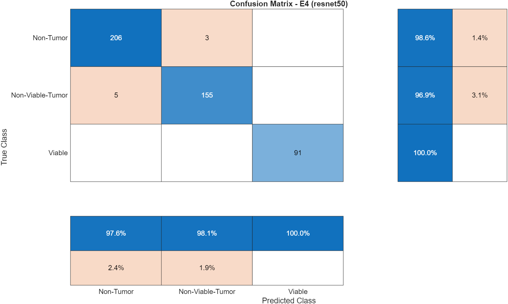 |

### 5. A/B Testing Confidence Intervals
To scientifically validate whether Data Augmentation or deeper network architecture provided a measurable benefit, we computed the **95% Confidence Intervals of Macro F1 Score differences** using an Empirical Bootstrap method (N=1000).

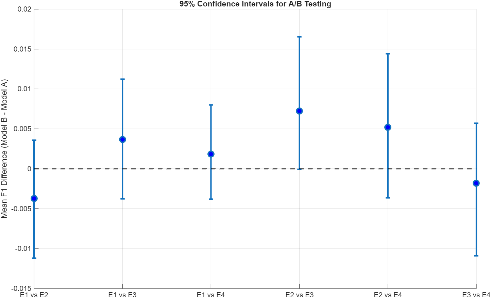

Full statistical significance reports are exported automatically to `results/statistics/ab_testing_results.csv`.

### 6. Computational Performance (Model Size)
We compared the overall footprint of the networks. While ResNet-50 provides deeper feature extraction, its parameter count leads to a significantly larger model size on disk, which directly impacts inference speed and potential deployment on embedded edge medical devices.

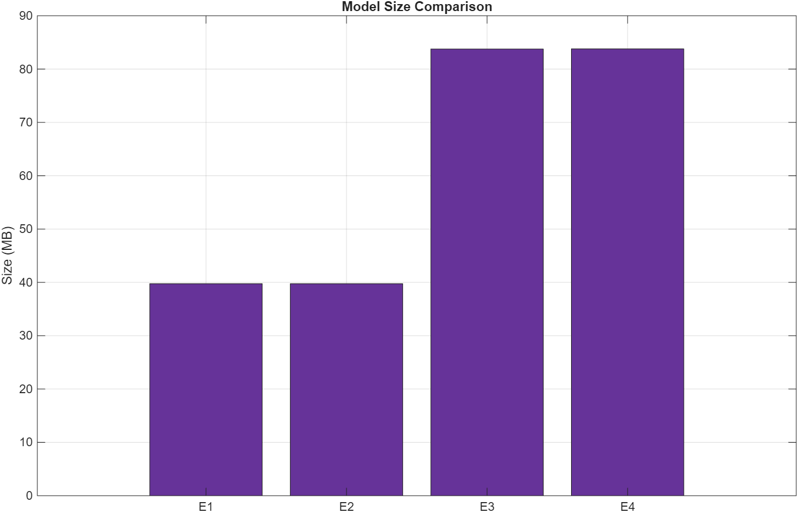

---

## Explainability via Grad-CAM (S03)
Deep learning models in medicine must be interpretable. We implemented a **Gradient-weighted Class Activation Mapping (Grad-CAM)** pipeline to visualize exactly *where* the model is looking when it makes a diagnostic prediction.

Our pipeline randomly samples images from the test set and projects the heatmap over the original histopathological slide across all 4 experiments simultaneously, allowing researchers to quickly verify if the AI is identifying legitimate cellular structures or overfitting to background artifacts.

### Visualizing Attention
*Notice how the red "hotspots" pinpoint the exact cellular structures the CNN relied on to make its final classification.*

**Example 1: Non-Tumor Detection**
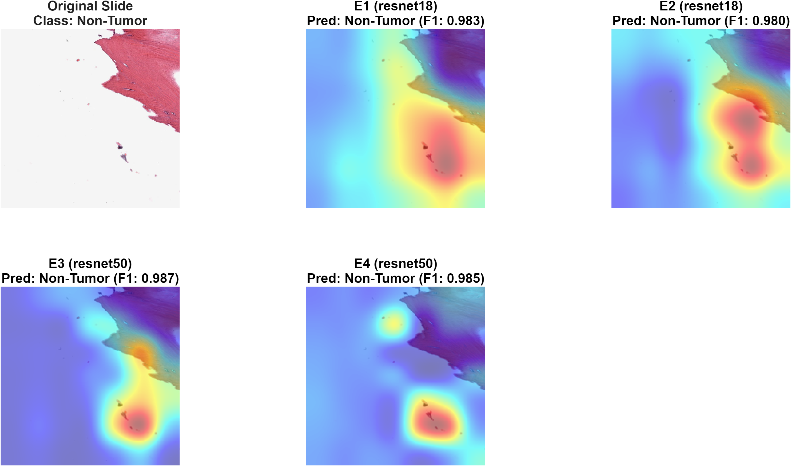

**Example 2: Non-Viable-Tumor Detection**
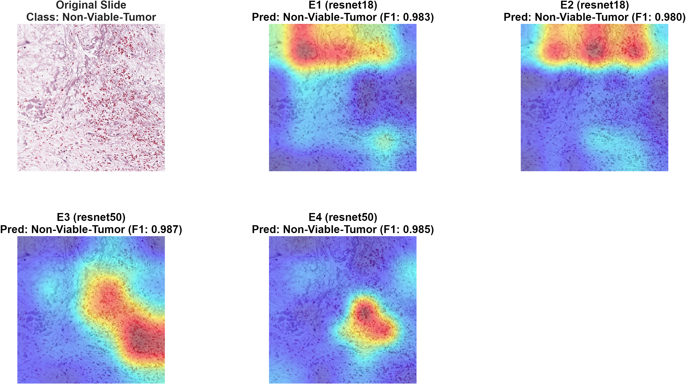

**Example 3: Viable Tumor Detection**

---

## How to Run the Pipeline

To reproduce the experiments and generate the analytical charts, run the MATLAB scripts in sequential order:

### `S01_DatasetPrep.m` (If applicable)
Generates the synthetically augmented `dataset_balanced` directory from the `dataset_original` structure.

### `S02_RunExperiments.m`
The core training engine.
- Instantiates ResNet-18 and ResNet-50.
- Automatically iterates through E1, E2, E3, and E4.
- Exports performance checkpoints to the `train/` directory and logs metrics to `experiments_results.csv`.

### `S04_Conclusion.m`
The master analytics engine. 
- Aggregates all CSV files generated by `S02`.
- Processes the unseen Test Set to calculate Confusion Matrices.
- Computes Per-Class Precision/Recall metrics, Model Sizes, and plots Training Curves.
- Runs the Bootstrapped A/B Testing algorithms and exports all PNG/CSV charts to the `results/` folder.

### `S03_ExplainabilityGradCAM.m`
The visual interpretability module.
- Automatically selects the best-performing model from each experiment (E1-E4).
- Selects 15 random slides (5 per class) from the Test Set.
- Generates transparent Grad-CAM heatmap overlays and saves them to `results/gradcam/`.
